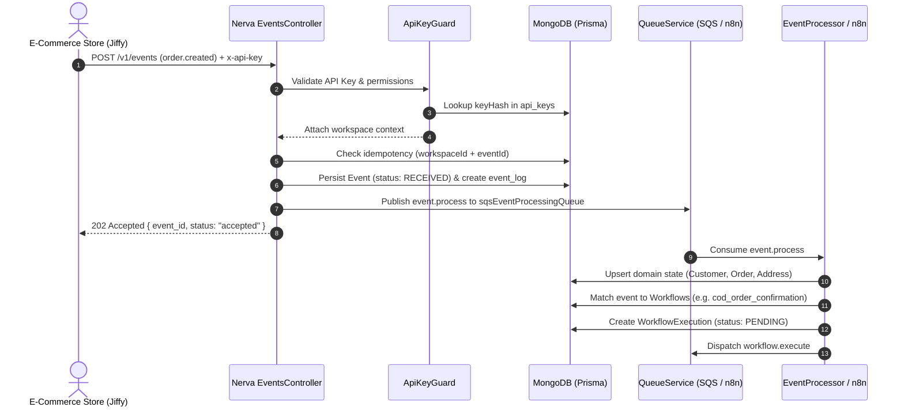
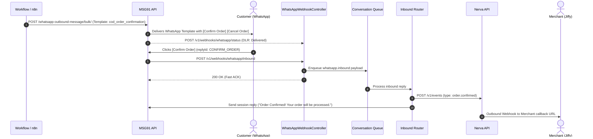
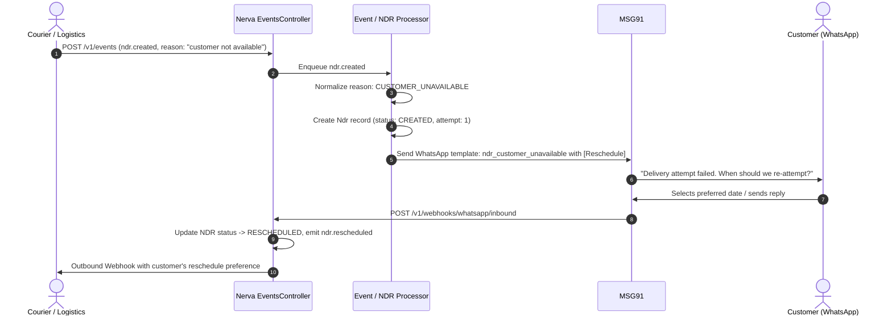

# Nerva — Multi-Tenant Commerce Engagement & Recovery Platform

## Executive Summary

**Nerva** is an enterprise-grade, multi-tenant commerce engagement and recovery platform designed for modern e-commerce systems (such as Jiffy, QuickFlo, Shopify, and custom storefronts). It orchestrates the post-purchase lifecycle, automating critical touchpoints including **Cash on Delivery (COD) confirmation**, **Address verification**, **Non-Delivery Report (NDR) rescue**, and **omnichannel conversational engagement** primarily over WhatsApp (via MSG91), SMS, and Email.

---

## 1. System Architecture & Tech Stack

```mermaid
flowchart TB
    subgraph Clients["E-Commerce / Clients"]
        MERCHANT["Merchant Store / Jiffy"]
        COURIER["Logistics / Courier (Delhivery, Bluedart, etc.)"]
    end

    subgraph NervaAPI["Nerva API Server (Port 5010)"]
        AUTH["Auth & ApiKeyGuard"]
        EVT_CTRL["Events Controller"]
        DOMAIN_CTRL["Domain Controllers (Orders, Shipments, NDR, Customers)"]
        WH_INBOUND["WhatsApp Inbound Controller (/v1/webhooks/whatsapp/*)"]
        SWAGGER["Swagger Docs (/docs)"]
    end

    subgraph DataStore["Data Layer"]
        MONGO[("MongoDB (Prisma ORM)")]
        REDIS[("Redis (Cache & Locks)")]
    end

    subgraph QueueEngine["Dual Queue / Message Broker Layer"]
        QUEUE_ROUTER{"QueueService (QUEUE_PROVIDER)"}
        SQS["AWS SQS / ElasticMQ"]
        N8N["n8n Webhook Engine (:5678)"]
    end

    subgraph WorkerProcessing["Worker / Automation Engine"]
        EVT_PROC["Event Processor"]
        WF_PROC["Workflow Execution Engine"]
        COMM_PROC["Communication Provider (MSG91)"]
        WH_OUT["Outbound Webhook Delivery"]
    end

    subgraph ExternalServices["External Services & End Users"]
        MSG91["MSG91 WhatsApp API"]
        CUSTOMER["Customer WhatsApp Client"]
        EXT_WH["Merchant Webhook URL"]
    end

    MERCHANT -->|POST /v1/events| AUTH --> EVT_CTRL
    COURIER -->|POST /v1/events (ndr.created)| AUTH --> EVT_CTRL
    EVT_CTRL --> MONGO
    EVT_CTRL --> QUEUE_ROUTER

    QUEUE_ROUTER -->|sqs mode| SQS --> EVT_PROC & WF_PROC & WH_OUT
    QUEUE_ROUTER -->|n8n mode| N8N

    EVT_PROC --> MONGO
    WF_PROC --> COMM_PROC --> MSG91 --> CUSTOMER
    N8N --> MSG91 --> CUSTOMER

    CUSTOMER -->|Button / Reply| MSG91
    MSG91 -->|POST /v1/webhooks/whatsapp/inbound| WH_INBOUND
    WH_INBOUND --> QUEUE_ROUTER
    WH_OUT --> EXT_WH
```

### Core Architecture Components

| Component | Technology | Role |
|---|---|---|
| **API Application** | NestJS, Express, Swagger | Port `5010`, prefix `/v1`. Ingestion of events, configuration, and data retrieval. |
| **Worker Application** | NestJS Microservices | Port `5011`. Consumes SQS queues for event processing and state execution. |
| **Database** | MongoDB 7.0 via Prisma ORM | Multi-tenant schema with document collections for organizations, workspaces, events, orders, and workflows. |
| **Caching & State** | Redis 7.2 (ioredis) | Session state, distributed locking, and rate limiting. |
| **Message Broker** | AWS SQS / ElasticMQ (or n8n) | Asynchronous decoupled execution via `QueueService`. |
| **BSP Provider** | MSG91 WhatsApp Business API | Bulk outbound template messages and two-way session messages. |

---

## 2. End-to-End Workflow & Business Flows

### Flow 1: Event Ingestion & Workflow Triggering



1. **Idempotency Guard**: Every ingested event is checked against `workspaceId` and `eventId`. Duplicate payloads return `202 Accepted` with `{ duplicate: true }` without re-executing actions.
2. **Domain Synchronization**: Automatically synchronizes and normalizes phone numbers (E.164 standard) and builds or updates Customer, Order, Shipment, and Address models.

---

### Flow 2: Cash on Delivery (COD) Confirmation via WhatsApp



1. **Outbound Dispatch**: Triggered when payment method is `COD`. Sends pre-approved interactive template with quick-action buttons.
2. **Inbound Processing**: MSG91 triggers `/v1/webhooks/whatsapp/inbound`. Controller immediately returns `200 OK` to prevent webhook timeouts and pushes the payload to the queue.
3. **Action Execution**:
   - `CONFIRM_ORDER`: Updates order state to `CONFIRMED`, emits `order.confirmed` event, sends confirmation message, and fires outbound webhooks to merchant systems.
   - `CANCEL_ORDER`: Emits `order.cancelled`, updates order, sends cancellation notice, and alerts merchant.

---

### Flow 3: Non-Delivery Report (NDR) Rescue



- **Courier Reason Normalization**: Normalizes disparate courier status texts into standard enums:
  - `CUSTOMER_UNAVAILABLE`: Prompts for rescheduling date/time.
  - `WRONG_ADDRESS` / `INCOMPLETE_ADDRESS`: Requests correct landmark and address details.
  - `CASH_UNAVAILABLE`: Offers online UPI payment link or cash preparation reminder.
  - `CUSTOMER_REFUSED`: Identifies dispute/cancellation reasons.

---

## 3. External API Catalog (Client & Merchant Facing)

All external APIs run under the `/v1` prefix and require authentication via:
`Authorization: Bearer <API_KEY>` or `x-api-key: <API_KEY>`.

### 1. Authentication & API Keys (`/v1/auth`)

| Endpoint | Method | Description |
|---|---|---|
| `/v1/auth/api-keys` | `POST` | Create a new API key for the authenticated workspace. Returns raw key once. |
| `/v1/auth/api-keys` | `GET` | List all API keys for the workspace (shows prefix, status, permissions). |
| `/v1/auth/api-keys/:id` | `DELETE` | Revoke an API key immediately (`204 No Content`). |

### 2. Event Ingestion (`/v1/events`)

| Endpoint | Method | Description |
|---|---|---|
| `/v1/events` | `POST` | Ingests business lifecycle events. Validates schema, checks idempotency, persists, and queues. Returns `202 Accepted`. |
| `/v1/events/:id` | `GET` | Retrieves full event payload, status (`RECEIVED`, `PROCESSING`, `PROCESSED`, `FAILED`), and processing timestamps. |

#### Registered Ingestion Event Types:
- **Order Lifecycle**: `order.created`, `order.updated`, `order.confirmed`, `order.cancelled`, `order.payment_success`, `order.payment_failed`
- **Checkout Lifecycle**: `checkout.created`, `checkout.updated`, `checkout.completed`, `checkout.abandoned`
- **Shipment Lifecycle**: `shipment.created`, `shipment.updated`, `shipment.picked_up`, `shipment.in_transit`, `shipment.out_for_delivery`, `shipment.delayed`, `shipment.delivered`, `shipment.failed`, `shipment.rto`
- **NDR Lifecycle**: `ndr.created`, `ndr.updated`, `ndr.rescheduled`, `ndr.resolved`, `ndr.failed`
- **Payment Lifecycle**: `payment.created`, `payment.success`, `payment.failed`, `payment.expired`
- **Internal Transitions**: `address.updated`, `address.verified`

### 3. Core Domain Entities

| Endpoint | Method | Description |
|---|---|---|
| `/v1/customers/:id` | `GET` | Get normalized customer profile (E.164 phone, consent status, metadata). |
| `/v1/customers/:id/conversations` | `GET` | Get all conversational history and active state sessions for a customer. |
| `/v1/orders/:id` | `GET` | Get complete order record including customer, shipments, and NDR attempts. |
| `/v1/shipments/:id` | `GET` | Get shipment details, AWB, courier name, and transit history. |
| `/v1/ndrs/:id` | `GET` | Get NDR attempt, courier raw reason, normalized reason, and resolution. |

### 4. Workflows & Executions (`/v1/workflows`, `/v1/executions`)

| Endpoint | Method | Description |
|---|---|---|
| `/v1/workflows` | `GET` | List all registered workflows with their workspace-specific enabled status. |
| `/v1/workflows/:id` | `GET` | Get workflow details, versions, and current configuration settings. |
| `/v1/workflows/:id/enable` | `POST` | Enable workflow execution for this workspace. |
| `/v1/workflows/:id/disable` | `POST` | Disable workflow execution for this workspace. |
| `/v1/workflows/:id/config` | `GET` | Retrieve timeout parameters, delays, and retry thresholds. |
| `/v1/workflows/:id/config` | `PUT` | Update configuration settings (e.g. reminder intervals). |
| `/v1/executions/:id` | `GET` | Inspect state machine execution progress, current step, and step outputs. |

### 5. Message Templates & Messages (`/v1/templates`, `/v1/messages`, `/v1/conversations`)

| Endpoint | Method | Description |
|---|---|---|
| `/v1/templates` | `GET` | List configured message templates across channels. |
| `/v1/templates` | `POST` | Register a new message template (WhatsApp, SMS, Email). |
| `/v1/templates/:id` | `PUT` | Update template content, variables, or external template IDs. |
| `/v1/messages/:id` | `GET` | Inspect status of a single message (`QUEUED`, `SENT`, `DELIVERED`, `READ`, `FAILED`). |
| `/v1/conversations/:id` | `GET` | Retrieve conversation thread, active state context, and past 50 messages. |

### 6. Merchant Outbound Webhooks (`/v1/webhooks`)

| Endpoint | Method | Description |
|---|---|---|
| `/v1/webhooks` | `GET` | List all outbound webhooks configured for this workspace. |
| `/v1/webhooks` | `POST` | Register an endpoint to receive real-time webhook updates from Nerva. |
| `/v1/webhooks/:id` | `PUT` | Update webhook target URL, subscribed events, or active status. |
| `/v1/webhooks/:id` | `DELETE` | Delete webhook subscription. |
| `/v1/webhooks/:id/test` | `POST` | Dispatch a test event (`webhook.test`) to verify endpoint handshake. |

### 7. Inbound Webhooks from Third Parties (MSG91 WhatsApp)

| Endpoint | Method | Auth | Description |
|---|---|---|---|
| `/v1/webhooks/whatsapp/inbound` | `POST` | Unauthenticated | Receives incoming messages, quick-reply button clicks, and list selections from MSG91. Enqueues to conversation processing. |
| `/v1/webhooks/whatsapp/status` | `POST` | Unauthenticated | Receives Delivery Reports (DLR: Submitted, Sent, Delivered, Read, Failed) from MSG91. |

### 8. System & Health

| Endpoint | Method | Auth | Description |
|---|---|---|---|
| `/docs` | `GET` | None | Interactive Swagger UI documentation. |
| `/health` | `GET` | None | Worker process health probe (Port `5011`). |

---

## 4. Internal APIs, Queues & Service Bus

Nerva employs a decoupled internal service bus where domain services interact through strongly-typed contracts and queue abstraction:

### Queue Message Specifications

| Queue Name / n8n Webhook Path | Payload Type | Key Fields | Handler / Worker |
|---|---|---|---|
| `notification-module-event-processing`<br>`/webhook/event-processing` | `event.process` | `eventDbId`, `eventId`, `eventType`, `workspaceId` | `EventProcessor` / n8n Router |
| `notification-module-workflow-execution`<br>`/webhook/workflow-execution` | `workflow.execute` | `executionId`, `workflowSlug`, `stepName` | `WorkflowProcessor` / n8n Exec |
| `notification-module-communication` | `communication.send` | `channel`, `to`, `templateName`, `params` | `CommunicationProcessor` |
| `notification-module-conversation-processing`<br>`/webhook/conversation-processing` | `whatsapp.inbound`<br>`whatsapp.status` | `customerPhone`, `messageUuid`, `replyId`, `status` | `ConversationProcessor` / n8n Reply Handler |
| `notification-module-webhook-delivery`<br>`/webhook/webhook-delivery` | `webhook.deliver` | `deliveryId`, `webhookId` | `WebhookDeliveryProcessor` / n8n Dispatch |
| `/webhook/ndr-rescue` | `ndr.rescue` | `ndrId`, `reason`, `phone`, `orderNumber` | n8n NDR Rescue Workflow |

### Internal Domain Services

```
src/modules/
├── auth/            -> AuthService (API key hashing, validation, cache)
├── events/          -> EventsService (Validation, deduplication, SQS publishing)
│                       EventRegistry (Whitelisted event catalog)
├── customers/       -> CustomersService (E.164 phone normalization, deduplication)
├── orders/          -> OrdersService (Order lifecycle, totals, addresses)
├── shipments/       -> ShipmentsService (AWB tracking, transit events)
├── ndr/             -> NdrService (Courier reason normalization, status updates)
├── workflows/       -> WorkflowExecutionService (State machine engine, step scheduler)
│                       WorkflowRegistryService (Event-to-workflow mapping)
│                       WorkflowConfigService (Per-tenant tuning parameters)
├── communications/  -> CommunicationService (Channel provider routing)
│                       WhatsAppProvider (MSG91 bulk & session HTTP client)
├── conversations/   -> ConversationsService (Session tracking, active state memory)
├── messages/        -> MessagesService (Message log, DLR state transitions)
├── webhooks/        -> WebhooksService (HMAC-signed webhook dispatcher)
├── audit/           -> AuditService (Non-blocking auditable event logger)
└── tenants/         -> TenantsService (Organizations, workspaces, stores)
```

---

## 5. Third-Party Integrations Consumed by Nerva

1. **MSG91 WhatsApp API (`https://control.msg91.com/api/v5/whatsapp`)**:
   - `POST /whatsapp-outbound-message/bulk/`: Pre-approved HSM template delivery.
   - `POST /whatsapp-outbound-message/`: 24-hour window session messaging.
2. **AWS SQS / ElasticMQ**:
   - Distributed messaging with at-least-once delivery and DLQs.
3. **OpenAI (`gpt-4o-mini`)**:
   - Configured for natural language understanding and free-text intent classification.
4. **Merchant Callback Webhooks**:
   - Outbound HTTP POST payloads with HMAC-SHA256 signature verification.

---

## 6. How to Run & Test

```bash
# 1. Install dependencies
npm install

# 2. Start backing services (MongoDB, Redis, ElasticMQ)
docker-compose up -d

# 3. Initialize Prisma and Seed Workspace
npx prisma db push
npm run prisma:seed

# 4. Start API and Worker concurrently
npm run start:dev

# 5. Run full end-to-end API test suite
powershell -ExecutionPolicy Bypass -File ./test-all-apis.ps1
```
